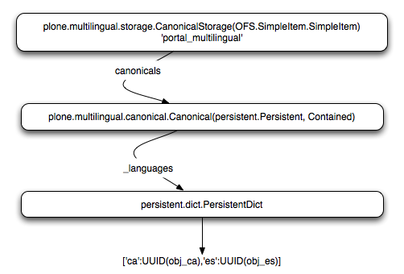
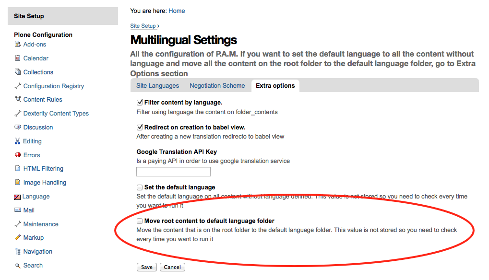
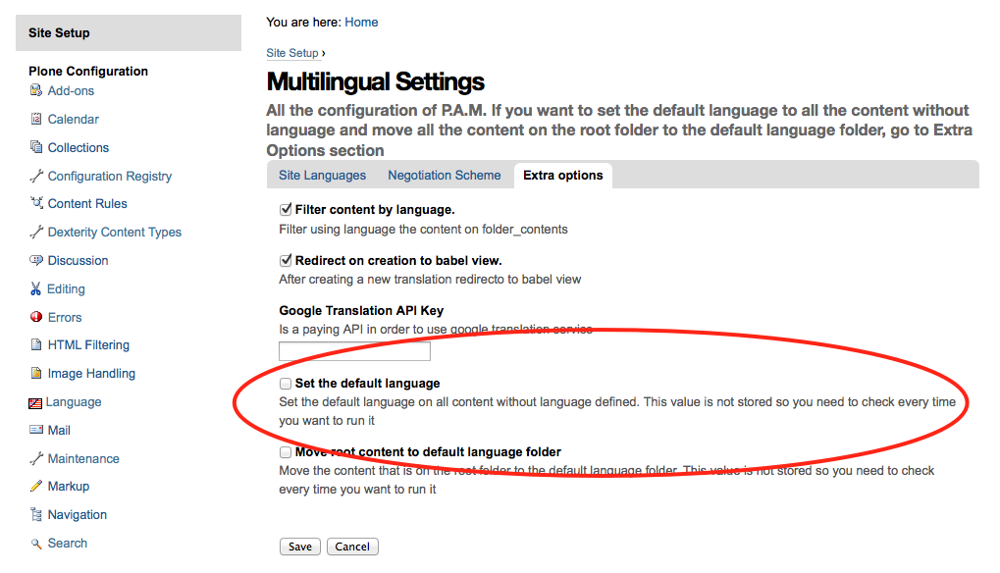
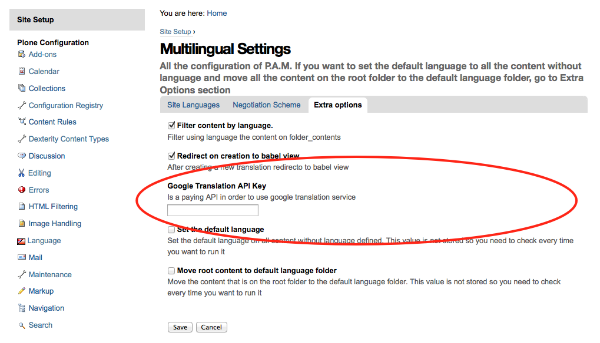
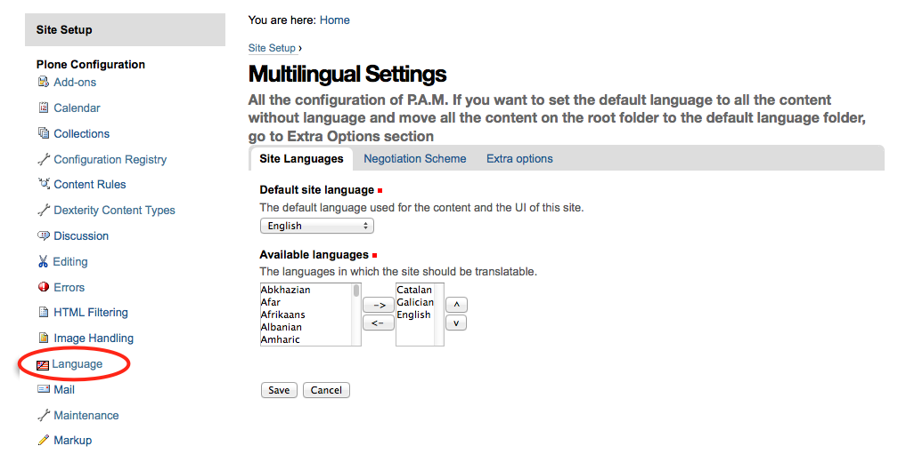

======================
plone.app.multilingual
======================

.. toctree::
   :maxdepth: 2

Introduction
============

Talking about multi-language support in Plone is talk about
Products.LinguaPlone. It's been the defacto standard for managing translations
of Archetypes-based content in Plone through the years. Somehow its
functionality never made its way into the Plone core. Nowadays, Plone faces the
rising of Dexterity content types and its incoming adoption into the Plone core
in the near future (4.3) and complete the transition to Plone default content
types in Plone 5.

plone.app.multilingual was designed originally to provide Plone a whole
multilingual story. Using ZCA technologies, enables translations to Dexterity
and Archetypes content types as well.

After more than 4 years, a GSOC, redesigns, new versions, reimplementations due
to deprecated libraries, two major Plone versions finally we are able to say
that plone.app.multilingual is here.

Features
========

 1. Archetype-based content types translation management
 2. Dexterity-based content types translation management
 3. Enhanced translation edit UI with already translated content
 4. Language independent fields support
 5. Google Translate service support

Internal design of plone.multilingual
======================================

All the internal features are implementated on the package plone.multilingual.

The key points are:

 1. Each translation is a different content object.
 2. There is no canonical object
 3. The translation reference infraestructure is external to the content object
 4. Adapt all the steps on translation
 5. Language get/set unification
 6. Translatable marker interface

No canonical content object
---------------------------

Having a canonical object on the content space produces a dependency which is
not orthogonal with the normal behavior of Plone. All content objects should be
autonomous and you should be able to remove it. This is the reason because we
removed the canonical content object. There is a canonical object on the
translation infrastructure but is not on the content space.

Translation reference infrastructure
------------------------------------

In order to maintain the relations between the different language objects we designed a local
utility that stores the relation tree on a BTREE. The relations with all the content are done
using default implementation of  UUIDs. We decided to push on that direction because:

 * UUID are the actual content object identifier
 * With external reference structure it's faster to remove or modify one translation
 * It's easier to work on all the translation (exports/imports)
 * It's easier to maintain the integrity of all the translations

   Canonical storage design

Adapt all the steps on translation
----------------------------------

All the different steps on a translation creation are adapted, it's possible to create different
policies for different types, sites, ...

The steps are :
  * ITranslationFactory - General factory used to create a new content
    * ITranslationLocator - Where are we going to locate the new translated content

        Default : If the parent folder is translated create the content on the translated parent folder, otherwise create on the parent folder.

    * ITranslationCloner - Method to clone the original object to the new one

        Default : Nothing

    * ITranslationIdChooser - Which id is the translation

        Default : The original id + lang code-block

  * ILanguageIndependentFieldsManager - Manager for language independent fields

    Default: Nothing

Language get/set unification
----------------------------

In order to know the language of a content type there is a interface/adapter :
plone.multilingual.interfaces.ILanguage

When you set a language on a content a subscriber change updates the canonical references.

Translatable marker interface
-----------------------------

In order to know if a content can be translated there is a marker interface :
plone.multilingual.interfaces.ITranslatable

Dexterity related features plone.multilingualbehavior
=====================================================

All the internal features are implemented on the package : plone.multilingualbehavior

The key points are :

 * Multilingual behavior
 * Language Independent Fields
 * Language get/set
 * Related fields

Multilingual behavior
---------------------

Marker interface : plone.multilingualbehavior.interfaces.IDexterityTranslatable

Language Independent Fields
---------------------------

*How to mark a field as language independent?*

There are four ways of achieve it:

 * Grok directive

.. code-block:: python

    from plone.multilingualbehavior import directives
    directives.languageindependent('field')

* Supermodel

.. code-block:: python

    lingua:independent="true"

 * Native

.. code-block:: python

    alsoProvides(ISchema[‘field'], ILanguageIndependentField)

 * TTW

    via the content type definition in the Dexterity configlet

Implementation
--------------

In order to maintain language independent fields on dexterity there is subscriber to ObjectModify
that copies the files to translations. There is lock detection implemented with a stack  in order
to stop deadlocks translations.

**Language get/set**

In order to get/set the language there is an implementation of the ILanguage interface that gets/sets
the correct language

**Related Fields**
If it’s a related field and is marked as language independent it will look for the translation on the
cloning/modifing process. With this feature it’s possible to create content vocabularies.

Archetypes related features archetypes.multilingual
===================================================

All the internal features are implementated on the package : archetypes.multilingual

The key points are :
 * Multilingual behavior
 * Language Independent Fields
 * Language get/set

Defining translatable content
-----------------------------

Marker interface : plone.multilingualbehavior.interfaces.IDexterityTranslatable

** Language Independent Fields **
XXX

** Language get/set **
XXX

UX plone.app.multilingual
=========================

All the internal features are implementated on the package : plone.app.multilingual

The key points are :
 * Control panel
 * Translation menu
 * Language viewlet
 * Babel view/edit
 * Language Index
 * Catalog Patch
 * Permission
 * Language root folder

API
===

**Get the translation manager**

.. code-block:: python

  from plone.multilingual.interfaces import ITranslationManager
  manager = ITranslationManager(context)

**Get the translations of an object**

.. code-block:: python

    translated_object = manager.get_translation(language_code-block)

**Add an empty translation of an object**

.. code-block:: python

    manager.add_translation(language_code-block)

**Register a translation of an object**

.. code-block:: python

    manager.register_translation(language_code-block, content)

**Get all translations**

.. code-block:: python

    manager.get_translations()
    # returns a dict with the language_code-blocks as keys

**Get all translations language code-block**

.. code-block:: python

    manager.get_translated_languages()

**Has a translation?**

.. code-block:: python

    manager.has_translation(language_code-block)

**Get the language of the content?**

.. code-block:: python

    from plone.multilingual.interfaces import ILanguage
    language = ILanguage(context).get_language()

**Set the language of the content?**

.. code-block:: python

    language = ILanguage(context).set_language(‘ca’)

**Vocabularies**

 * plone.app.multilingual.browser.vocabulary.untranslated_languages(context)
   * get the languages on which the context is not translated and the language is configured
   * returns a SimpleVocabulary with the languages code-blocks and it’s name
 * plone.app.multilingual.browser.vocabulary.translated_languages(context)
   * get the languages on which the context is translated
   * returns a SimpleVocabulary with the languages code-blocks and it’s name
 * plone.app.multilingual.browser.vocabulary.translated_urls(context)
   * get the urls of the translated objects
   * returns a SimpleVocabulary with the languages code-blocks and the urls
 * plone.app.multilingual.browser.vocabulary.deletable_languages(context)
   * get the languages from the objects that are translated and not available on the site
   * returns a SimpleVocabulary with the languages code-blocks and it’s name

HOW-TO..
========

Install
-------

In order to install plone.app.multilingual without dexterity support you should add to buildout and run buildout:

.. code-block:: python

  eggs =
        ...
        plone.app.multilingual
        ...

In order to install plone.app.multilingual with dexterity support you should add to buildout and run buildout:

.. code-block:: python

 eggs =
        ...
        plone.app.multilingual
        plone.multilingualbehavior
        ...

Setup
-----

After installation you should be able to access Language settings on the control panel.

   How to setup

Here you can select which languages do you want to enable on you site and the order they will apear on the UI. On save the language folders will be created on the root folder with INavigationRoot marker interface, the default view on the site root will be moved to the default language folder and a redirect view will be configured on the site root in order to redirect users to the language folder. If you have content on you site you will need to set language on it and move it to the language folder. There is a option on control panel in order to do this task explained on howto section.

I have a site with content and I want to have a multilingual site
-----------------------------------------------------------------

 * Install plone.app.multilingual with/out dexterity support depending if the content is dexterity
 * Configure the needed languages on the control panel and Save
 * Set the default language on all the content that doesn’t have language defined using the control
   panel option. You must check the option and save. On the error log will apear all the objects
   that has been modified.
 * Move the root folder default language content to the default language using the control panel option.
   You must check the option and save. On the error log will apear all the objects that has been modified.

I want to enable a dexterity type to be translatable
----------------------------------------------------

You can enable the behavior TTW or just add the plone.multilingualbehavior.interfaces.IDexterityTranslatable
behavior on the FTI definition.

I want to have dexterity language independent fields
----------------------------------------------------

It’s explained on the Dexterity section the three possible ways to define a language independent field

I want to have archetypes language independent fields
-----------------------------------------------------

XXX

I want to use Google Translate service on babel view
----------------------------------------------------

You should go to https://code-block.google.com/apis/console/ and copy your google api key to the language control panel.
ALERT: this is a google paid service!

I want to have a vocabulary for a field that is translatable
------------------------------------------------------------

You can create on Dexterity types a relationfield to another interface. If this field is language independent
it’ll maintain for each translation the correct vacabulary.

I'm moving from LinguaPlone to PAM...
-------------------------------------

We enabled the option to have both systems installed and a migration script (actully in process XXX )
